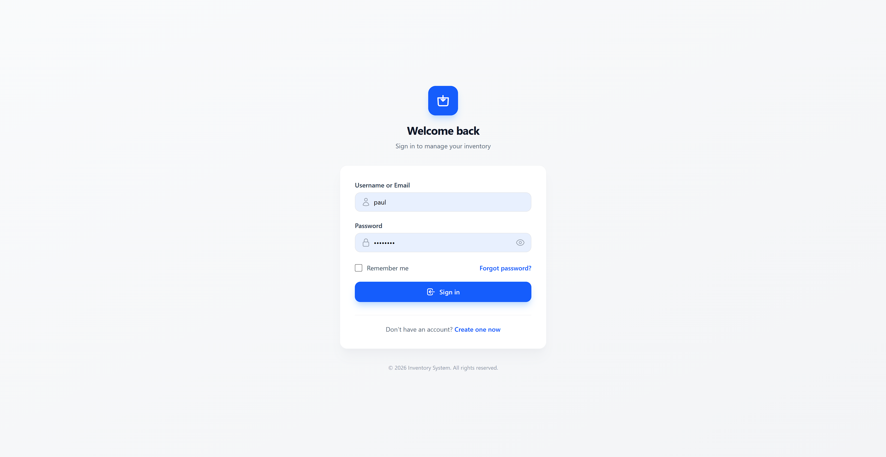
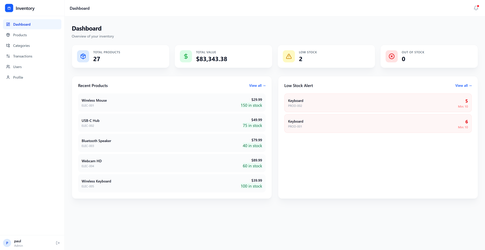
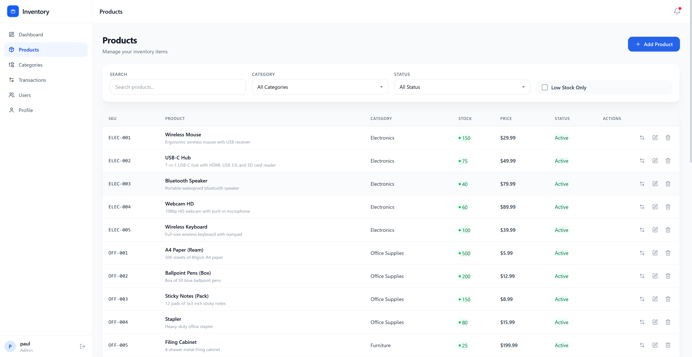
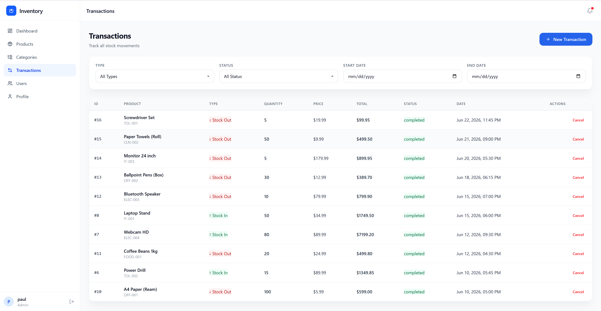

# 📦 Inventory Management System

A full-stack inventory management system built with **Vue.js 3**, **TypeScript**, **Express.js**, and **MySQL**.

---

## 📸 Screenshots

### Login Page

### Dashboard

### Products Page

### Transactions Page

---

## 🚀 Features

- 🔐 **Authentication** - JWT-based login/register with role-based access (Admin, Manager, Staff)
- 📦 **Product Management** - Full CRUD operations, SKU tracking, categories, stock levels
- 📊 **Dashboard** - Real-time inventory stats, low stock alerts, total inventory value
- 💰 **Transactions** - Stock in/out tracking with automatic quantity updates
- 📁 **Categories** - Organize and manage product categories
- 👥 **User Management** - Admin panel for managing users and roles
- 🎨 **Modern UI** - Clean, responsive design with Tailwind CSS
- 📱 **Mobile Friendly** - Responsive sidebar and layouts for all devices
- 🔍 **Search & Filter** - Advanced search and filtering for products and transactions
- 📈 **Stock Alerts** - Visual indicators for low stock and out of stock items

---

## 🛠️ Tech Stack

### Frontend
| Technology | Purpose |
|------------|---------|
| **Vue.js 3** | UI Framework (Composition API) |
| **TypeScript** | Type Safety |
| **Vite** | Build Tool |
| **Tailwind CSS v4** | Styling |
| **Pinia** | State Management |
| **Vue Router** | Navigation |
| **Axios** | HTTP Client |
| **Lucide Vue Next** | Icons |
| **Vue Toastification** | Notifications |

### Backend
| Technology | Purpose |
|------------|---------|
| **Node.js** | Runtime |
| **Express.js** | Web Framework |
| **TypeScript** | Type Safety |
| **Sequelize** | ORM |
| **MySQL** | Database |
| **JWT** | Authentication |
| **bcrypt** | Password Hashing |
| **Joi** | Input Validation |
| **Winston** | Logging |
| **Helmet** | Security Headers |
| **CORS** | Cross-Origin Requests |

---

## 📁 Project Structure
